# Introdcution

Knowledge Graphs are a sophisticated tools to organize and represent
knowledge, central to many applications in artificial intelligence and
data management. They leverage concepts from graph theory to model
relationships between entities in a structured manner.

At the heart of a Knowledge Graph are nodes and edges. Nodes represent
entities—such as people, organizations, or concepts—while edges denote
the relationships between these entities. For example, in a Knowledge
Graph about a movie industry, nodes could include actors and films,
and edges would capture relationships like "acted in" or "produced
by."

The information in a Knowledge Graph is typically stored in a triple
store, a specialized type of database optimized for handling data in
the form of triples. A triple consists of a subject, predicate, and
object, which together convey a piece of factual information or a
relationship. For instance, the triple ("The Matrix", "directed by",
"Lana Wachowski") captures the relationship between a movie and its
director.

```mermaid
graph TD
    KnowledgeGraph -->|composed of| ComposedOfNodes[Nodes]
    KnowledgeGraph -->|connected by| ConnectedByEdges[Edges]
    KnowledgeGraph -->|structured by| StructuredByOntologies[Ontologies]
    KnowledgeGraph -->|enables| EnablesQuerying[Querying]
    KnowledgeGraph -->|supports| SupportsReasoning[Reasoning]
    KnowledgeGraph -->|can be| CanBePropertyGraph[Property Graph]

    ComposedOfNodes -->|represent| RepresentEntities[Entities]
    ComposedOfNodes -->|include| IncludeConcepts[Concepts]

    ConnectedByEdges -->|represent| RepresentRelationships[Relationships]
    ConnectedByEdges -->|include| IncludeProperties[Properties]

    StructuredByOntologies -->|define| DefineClasses[Classes]
    StructuredByOntologies -->|specify| SpecifyProperties[Properties]
    StructuredByOntologies -->|include| IncludeInstances[Instances]

    SupportsReasoning -->|involves| InvolvesInference[Inference]
    SupportsReasoning -->|utilizes| UtilizeRuleEngines[Rule Engines]

    CanBePropertyGraph -->|composed of| PropertyGraphNodes[Nodes]
    CanBePropertyGraph -->|connected by| PropertyGraphEdges[Edges]
    CanBePropertyGraph -->|uses| PropertyGraphLabels[Labels]
    CanBePropertyGraph -->|includes| PropertyGraphProperties[Properties]
    CanBePropertyGraph -->|can have| PropertyGraphTypes[Types]
    CanBePropertyGraph -->|can have| PropertyGraphIndexes[Indexes]

    PropertyGraphLabels -->|used for| LabelingNodes[Node Labeling]
    PropertyGraphLabels -->|used for| LabelingEdges[Edge Labeling]

    PropertyGraphTypes -->|specify| EdgeTypes[Types of Edges]
    PropertyGraphTypes -->|specify| NodeTypes[Types of Nodes]

    PropertyGraphIndexes -->|enhance| IndexingNodes[Node Indexing]
    PropertyGraphIndexes -->|enhance| IndexingEdges[Edge Indexing]
```

# Knowledge graphs vs. traditional relational data bases

Knowledge graphs and traditional relational databases serve the
purpose of storing and managing data, but they do so in fundamentally
different ways, each with its own advantages and use cases.

In terms of data model, relational databases organize data into tables
with predefined schemas, using rows and columns. Relationships between
data are managed through foreign keys and join operations, and the
schema is strict and rigid, often requiring complex alterations to
change. Conversely, knowledge graphs represent data as a graph
composed of nodes (entities) and edges (relationships). Relationships
are naturally depicted as edges connecting nodes, which allows complex
relationships to be directly modeled. Knowledge graphs offer a
flexible, often schema-less structure that can easily accommodate
changes and additions without restructuring existing data.

When it comes to query language, relational databases use SQL
(Structured Query Language). While SQL is efficient for
straightforward queries, complex joins can become slow and
cumbersome. Knowledge graphs, on the other hand, use graph-specific
query languages such as SPARQL (for RDF-based graphs) or Cypher (for
property graphs like Neo4j). These languages excel at traversing
relationships and querying connected data, often allowing for more
intuitive and expressive queries for relationship-heavy data.

Regarding data integrity and constraints, relational databases have
strong support for data integrity through constraints like primary
keys, foreign keys, unique constraints, and check constraints. They
typically support ACID (Atomicity, Consistency, Isolation, Durability)
properties for transactions, ensuring data reliability. Knowledge
graphs generally have more relaxed constraints, focusing on
flexibility over strict enforcement. ACID compliance varies by
implementation, with some providing ACID transactions and others
favoring eventual consistency models.

In terms of performance and scalability, relational databases are
optimized for transactional operations (OLTP) and aggregate
queries. They commonly scale vertically (scaling up), but horizontal
scaling (sharding) can be complex and less efficient. Knowledge graphs
are optimized for relationship-heavy queries and traversals. They are
naturally suited for horizontal scaling and distributed architectures,
making them ideal for large-scale data sets and big data applications.

The use cases for relational databases and knowledge graphs differ
significantly. Relational databases are best for structured data with
well-defined schema and relationships, transactional systems (e.g.,
banking systems, ERP systems), and applications requiring complex
joins on structured data. Examples include financial transactions,
inventory management, and CRM systems. Knowledge graphs, however, are
best for highly interconnected data, complex relationship queries, and
scenarios requiring flexible schema evolution. They are particularly
useful in semantic web, recommendation systems, fraud detection, and
knowledge management. Examples include social networks, recommendation
engines, and AI applications requiring contextual understanding.

It is beneficial to use knowledge graphs instead of relational
databases in several scenarios. Knowledge graphs are advantageous when
the data model involves numerous and complex relationships that need
to be efficiently queried and traversed, such as social networks or
recommendation systems. They are also beneficial when the schema is
likely to evolve or is not fully known upfront, allowing the addition
of new types of relationships and entities without major
restructuring. Additionally, knowledge graphs excel in integrating
diverse data sources and providing a unified view of the data with
semantic context, making them ideal for knowledge management or
semantic search applications. They support graph algorithms (e.g.,
shortest path, centrality measures) for analytics and insights, and
are useful for integrating heterogeneous data sources into a cohesive
framework, as seen in large-scale knowledge graphs like Google’s
Knowledge Graph or Linked Data.

## Glossary

- Semantics

- Ontology

- Vocabulary

- Edge 

- Node

- Triple store
