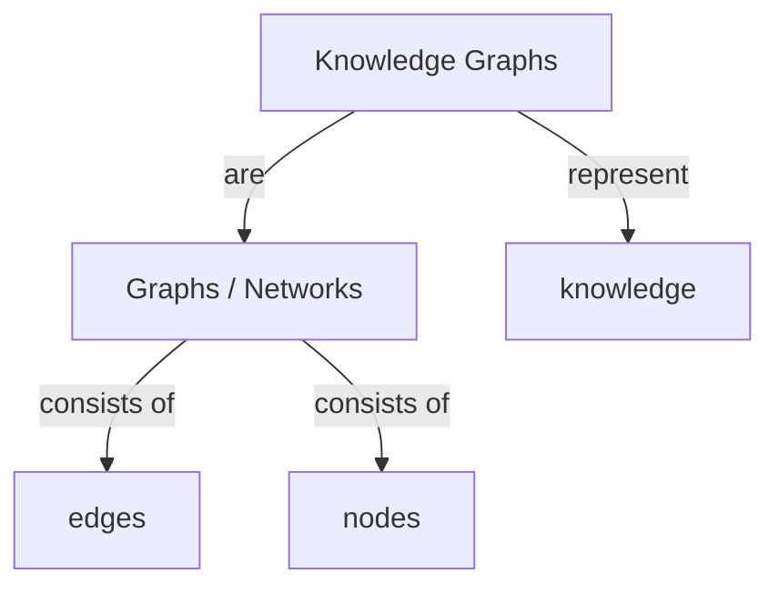

```mermaid
  graph TD;

  knowledge_graphs[Knowledge Graphs]
  graphs[Graphs / Networks]
  nodes[nodes]
  edges[edges]

  knowledge_graphs -->|are| graphs
  knowledge_graphs -->|represent| knowledge
  graphs -->|consists of| edges
  graphs -->|consists of| nodes
  
```

1. from data to knowledge
  - the same entity can have different meanings (Jaguar = animal, sports team, automobile, video game console) 
